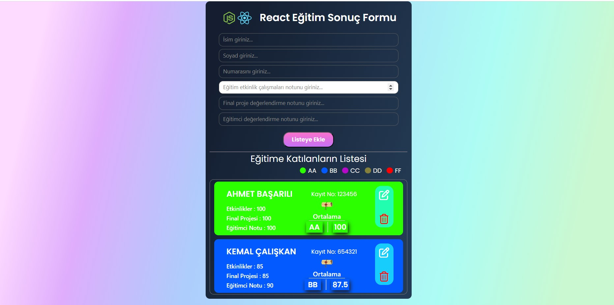

# JS-Project-2- Öğrenci Puan Tablosu

##JS eğitiminde hazırlanmış projedir.

# "React Eğitimi Katılımcı Formu" html-scss-JS yapı ile oluşturulmuştur.

### udemig ödev çalışmasıdır...

### Bu çalışma öğrenci bilgilerinin ve puanlarının girilemesi ile bir form oluşturmak amacıyla tasarlanmıştır. Özellikleri;
#### Ad ve Soyad giriş sonrası ekranda büyük harfe çevrildi. 
#### No ve puan girişleri sayı girişi number olarak izin verildi.
#### Puan girişleri 10 ile 100 sayıları arası sınır koyuldu.
#### Puan hesaplamasında etkinlik %40 ve final proje %60 eğitici notu ile bunun ortalaması alındı.
#### Silme ve düzeltme butonları aktif edildi. bu işlemlerde ekrana kişi ile ilgili bilgi notu yansıtıldı.
#### Tüm girilen bilgiler ekrana yansıtıldı.
#### kişi listesi arka plan rengi harf notu ile eşleştirildi.
#### Harf notu FF olan kişide diploma resmi kaldırılıp yerine "kaldı ibaresinin gelmesi sağlandı.

# JS-2-ogrenci-puan-tablosu
